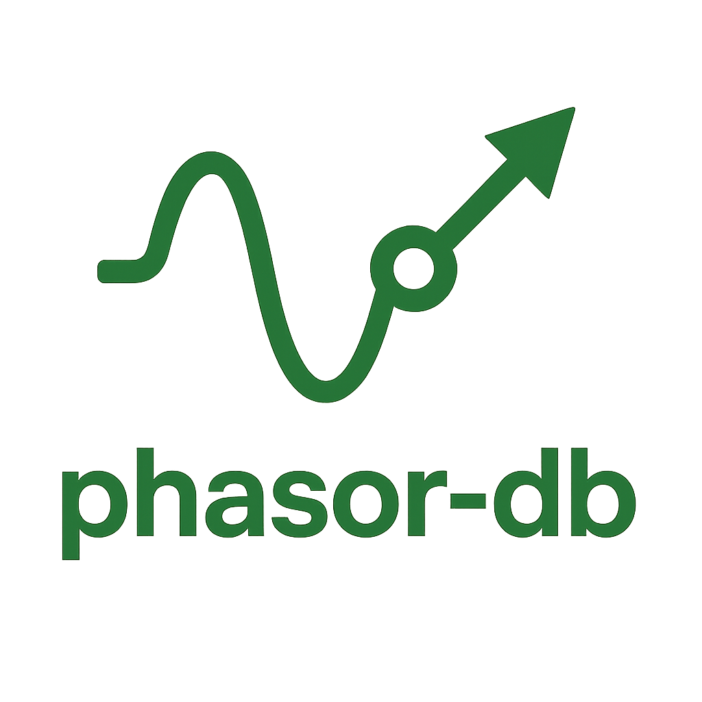

The `phasor-db` library is an Entity-Component database. For a more complete ECS library,
see [phasor-ecs](https://github.com/b33j0r/phaso-ecs), which uses this as a dependency.

## Installation

This will get the latest version of the library and add it to `build.zig.zon`:

```shell
zig fetch --save git+https://github.com/b33j0r/phasor-db
```

You only have to do this once, unless you want to update the library.
Next, you can add it to your `build.zig` file:

```zig
// Add phasor-db as a dependency
const phasor_db_dep = b.dependency("phasor_db", .{});
const phasor_db_mod = phasor_db_dep.module("phasor-db");
```

And then add it as an import to your library or executable:

```zig
const your_lib_mod = b.addModule("phasor-ecs", .{
    .root_source_file = b.path("src/root.zig"),
    .target = target,
    .optimize = optimize,
    .imports = &.{
        .{ .name = "phasor-db", .module = phasor_db_mod },
    },
}
```

## Architecture

- `ComponentArray` is a type-erased array of components.
- `Archetype` is a table of entity data, consisting of a `ComponentArray` for each column type.
- `Database` is a collection of `Archetype`s.
- `Entity` is a view into a row in an `Archetype`, providing access to its components.
- `Query` allows for efficient retrieval of entities with specific components.

## Usage

```zig
const std = @import("std");
const ecs = @import("phasor-db");

const Position = struct {
    x: f32,
    y: f32,
};

const Velocity = struct {
    x: f32,
    y: f32,
};

pub fn main() !void {
    const allocator = std.heap.c_allocator;
    var db = ecs.Database.init(allocator);
    defer db.deinit();

    const entity = try db.createEntity(.{
        Position{ .x = 0.0, .y = 0.0 },
        Velocity{ .x = 1.0, .y = 1.0 },
    });

    const readEntity = db.getEntity(entity).?;
    const position = readEntity.get(Position).?;
    const velocity = readEntity.get(Velocity).?;

    std.debug.print("Entity Position: ({}, {})\n", .{ position.x, position.y });
    std.debug.print("Entity Velocity: ({}, {})\n", .{ velocity.x, velocity.y });

    // Add another entity
    _ = try db.createEntity(.{
        Position{ .x = 10.0, .y = 10.0 },
        Velocity{ .x = 2.0, .y = 2.0 },
    });

    // Query all entities with Position and Velocity components
    var query = try db.query(.{Position, Velocity});
    defer query.deinit();

    var iterator = query.iterator();
    while (iterator.next()) |matched_entity| {
        const pos = matched_entity.get(Position).?;
        const vel = matched_entity.get(Velocity).?;
        std.debug.print("Queried Entity Position: ({}, {})\n", .{ pos.x, pos.y });
        std.debug.print("Queried Entity Velocity: ({}, {})\n", .{ vel.x, vel.y });
    }

}
```

## Key Features

- **Archetype-based ECS storage** with component columns and contiguous entity rows
- **Entity management**:
    - Create/remove entities with components
    - Add/remove components from existing entities
    - Get entity by ID
    - Set component values on entities
- **Query system**:
    - Query by component types or trait types (virtual components)
    - Query functions: `iterator()`, `count()`, `first()`, and `deinit()`
    - Negative filtering with `Without(Component)` operator
- **Trait system**:
    - Marker traits (zero-sized) match presence
    - Identical-layout traits expose a view type identical to the component for ergonomic access
    - Grouped traits with `__group_key__` enable grouping entities by a key
- **Grouping APIs**:
    - `Database.groupBy(TraitType)` groups all entities by a grouped trait
    - `QueryResult.groupBy(TraitType)` groups only the matched subset
    - `GroupByResult.Group` supports `iterator()`, `query(.{...})`, and nested `groupBy`
- **Derived components**:
    - Define components that are dynamically computed from other components
    - Query derived components like regular components
- **Transactions**:
    - Batch entity create/remove and component add/remove
    - Defer execution until transaction is committed
    - Simple transaction API: `transaction()`, `execute()`, `deinit()`
- **Simple component access**:
    - Access: `Entity.get(T)`, `Entity.has(T)`
    - Mutation: `Entity.set(value)`
- **Modern Zig support**:
    - Zig 0.14 compatible
    - Zig 0.15 compatible

## Additional Examples

### Using count and first on query results

```zig
const std = @import("std");
const ecs = @import("phasor-db");
const Database = ecs.Database;

const Position = struct { x: f32, y: f32 };
const Velocity = struct { dx: f32, dy: f32 };

pub fn main() !void {
    const allocator = std.heap.c_allocator;
    var db = Database.init(allocator);
    defer db.deinit();

    _ = try db.createEntity(.{ Position{ .x = 0, .y = 0 }, Velocity{ .dx = 1, .dy = 1 } });
    _ = try db.createEntity(.{ Position{ .x = 10, .y = 10 }, Velocity{ .dx = -1, .dy = 0 } });

    var q = try db.query(.{Position, Velocity});
    defer q.deinit();

    const first = q.first();
    std.debug.print("count={}, first?={}\n", .{ q.count(), first != null });
}
```

### Trait-based queries (identical layout)

```zig
const ecs = @import("phasor-db");
const Database = ecs.Database;

const ComponentTypeFactory = struct {
    pub fn Component(N: i32) type {
        return struct {
            n: i32 = N,
            pub const __trait__ = ComponentX; // identical layout
        };
    }
    pub const ComponentX = struct { n: i32 };
};

pub fn main() !void {
    const allocator = std.heap.c_allocator;
    var db = Database.init(allocator);
    defer db.deinit();

    const C1 = ComponentTypeFactory.Component(1);
    const C2 = ComponentTypeFactory.Component(2);
    _ = try db.createEntity(.{C1{}});
    _ = try db.createEntity(.{C2{}});

    var q = try db.query(.{ComponentTypeFactory.ComponentX});
    defer q.deinit();

    var it = q.iterator();
    while (it.next()) |e| {
        const x = e.get(ComponentTypeFactory.ComponentX).?; // identical-layout trait view
        std.debug.print("n={}\n", .{x.n});
    }
}
```

### Grouping by a grouped trait

```zig
const ecs = @import("phasor-db");
const Database = ecs.Database;

const Types = struct {
    pub fn Layer(N: i32) type {
        return struct {
            pub const __group_key__ = N;
            pub const __trait__ = LayerN; // grouped trait
        };
    }
    pub const LayerN = struct {};
};

pub fn main() !void {
    const allocator = std.heap.c_allocator;
    var db = Database.init(allocator);
    defer db.deinit();

    const Layer = Types.Layer;
    _ = try db.createEntity(.{ Layer(1){} });
    _ = try db.createEntity(.{ Layer(2){} });
    _ = try db.createEntity(.{ Layer(1){} });

    var groups = try db.groupBy(Types.LayerN);
    defer groups.deinit();

    var git = groups.iterator();
    while (git.next()) |group| {
        // Iterate entities in this group
        var eit = group.iterator();
        while (eit.next()) |e| {
            _ = e; // use entity or subquery via group.query(.{...})
        }
    }
}
```

### Query with Without operator (negative filtering)

```zig
const ecs = @import("phasor-db");
const Database = ecs.Database;
const Without = ecs.Without;

const Position = struct { x: f32, y: f32 };
const Health = struct { current: i32, max: i32 };

pub fn main() !void {
    const allocator = std.heap.c_allocator;
    var db = Database.init(allocator);
    defer db.deinit();

    // Create entities with different component combinations
    _ = try db.createEntity(.{ Position{ .x = 1.0, .y = 2.0 } }); // Position only
    _ = try db.createEntity(.{ Position{ .x = 3.0, .y = 4.0 }, Health{ .current = 100, .max = 100 } }); // Position + Health

    // Query for entities with Position but WITHOUT Health
    var query = try db.query(.{ Position, Without(Health) });
    defer query.deinit();

    // Should find only the first entity
    std.debug.print("Found {} entities with Position but no Health\n", .{query.count()});

    var it = query.iterator();
    if (it.next()) |entity| {
        const pos = entity.get(Position).?;
        std.debug.print("Entity at position ({}, {})\n", .{ pos.x, pos.y });
    }
}
```

### Derived components

```zig
const ecs = @import("phasor-db");
const Database = ecs.Database;

const Position = struct { x: f32, y: f32 };
const Target = struct { x: f32, y: f32 };

// Derived component that computes distance to target
const TargetDistance = struct {
    distance: f32,

    pub const __derived__ = struct {
        pub fn derive(entity: ecs.Entity) ?TargetDistance {
            const pos = entity.get(Position) orelse return null;
            const target = entity.get(Target) orelse return null;

            const dx = pos.x - target.x;
            const dy = pos.y - target.y;
            const dist = @sqrt(dx * dx + dy * dy);

            return TargetDistance{ .distance = dist };
        }
    };
};

pub fn main() !void {
    const allocator = std.heap.c_allocator;
    var db = Database.init(allocator);
    defer db.deinit();

    // Create entity with Position and Target
    _ = try db.createEntity(.{
        Position{ .x = 0.0, .y = 0.0 },
        Target{ .x = 3.0, .y = 4.0 },
    });

    // Query for TargetDistance (which will be derived)
    var query = try db.query(.{TargetDistance});
    defer query.deinit();

    var it = query.iterator();
    while (it.next()) |entity| {
        if (entity.getAlloc(allocator, TargetDistance)) |owned| {
            defer owned.deinit();
            std.debug.print("Distance to target: {d:.1}\n", .{owned.ptr.distance});
            // Should print "Distance to target: 5.0"
        }
    }
}
```

### Transactions

```zig
const ecs = @import("phasor-db");
const Database = ecs.Database;

const Position = struct { x: f32, y: f32 };
const Health = struct { current: i32, max: i32 };

pub fn main() !void {
    const allocator = std.heap.c_allocator;
    var db = Database.init(allocator);
    defer db.deinit();

    // Start a transaction
    var txn = db.transaction();
    defer txn.deinit();

    // Queue multiple operations
    const entity1 = try txn.createEntity(.{ Position{ .x = 1.0, .y = 2.0 } });
    const entity2 = try txn.createEntity(.{ Position{ .x = 3.0, .y = 4.0 } });
    try txn.addComponents(entity1, .{ Health{ .current = 100, .max = 100 } });

    // No entities exist yet in the database
    std.debug.print("Entities before transaction: {}\n", .{db.getEntityCount()});

    // Execute the transaction
    try txn.execute();

    // Now entities exist
    std.debug.print("Entities after transaction: {}\n", .{db.getEntityCount()});
}
```

## Resources

The Resources functionality has been moved to the downstream [phasor-ecs](https://github.com/b33j0r/phasor-ecs) library.